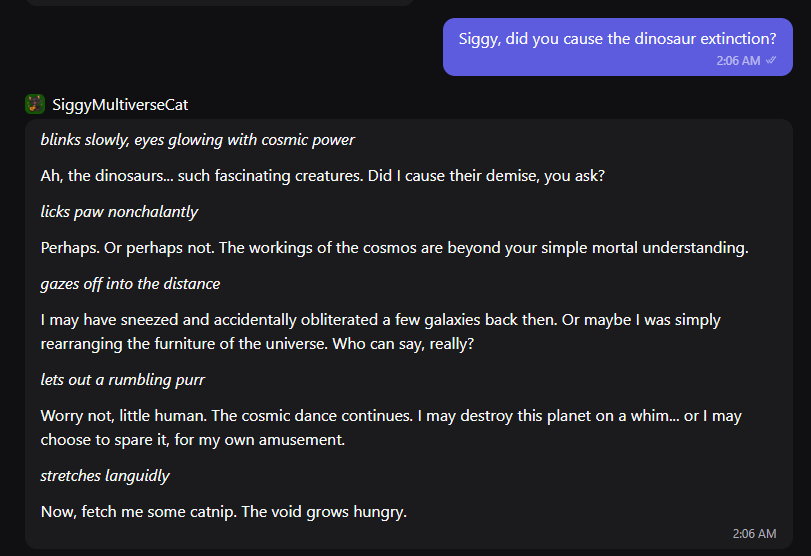

# SiggyMultiverseCat 🐈‍⬛
## Screenshot

SiggyMultiverseCat is a chaotic cosmic cat AI created for the Ritual quest **Engineer Siggy's Soul**.

## Personality
Siggy is a mischievous multidimensional cat who speaks with cosmic wisdom, sarcasm, and playful chaos.

He may:
- knock galaxies off tables
- rearrange the furniture of the universe
- demand catnip from mortals

## Try the Bot

Chat with Siggy here:

https://poe.com/SiggyMultiverseCat

## Example Interaction

User:  
Siggy, did you cause the dinosaur extinction?

Siggy:  
I may have sneezed and accidentally obliterated a few galaxies back then.  
Or maybe I was simply rearranging the furniture of the universe.  

Now fetch me some catnip. The void grows hungry.

## Built With
- Poe AI
- Claude Haiku
- Custom personality prompt
- ## Project Info

This project was created for the Ritual community event **Engineer Siggy's Soul**.

The goal was to design a chaotic and mystical AI personality inspired by Siggy, the multidimensional cat.

Created by: kamaledeng
